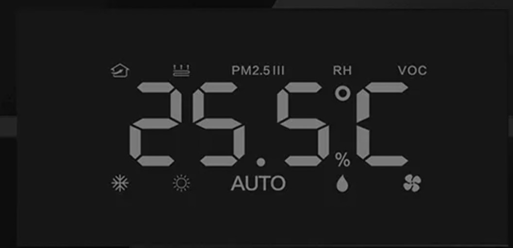

# react-native-led-number
纯CSS模拟LED夜晶数字字体-Digital 7 Font

减少字体的引入



# Usage

|props|description|default|
|--|--|
|`text`|[1-9]、"-"负号"、"c"|""|
|`size`|1~2,呈n^8指数增长|1.3|
|`color`|高亮部分的颜色|`rgba(121, 121, 121, 1)`|

> `text`: 需要支持其他字母的可以fork补充

```jsx
import LED from 'react-native-led-number'

<LEDText 
  text="2"
  size={1.3}
  color="gray"
/>
```